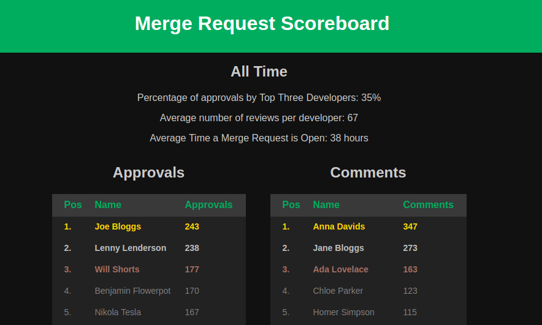

# Merge Request Queryer
A tool to read merge request approvals and comments by user from Gitlab

## Setup

- Run `npm install`
- Build with `npm run build`

## To Run

- Copy the example.env - `cp example.env .env`
- Set the following environment variables
  - PRIVATE_TOKEN: a token for your account in gitlab, can be created in /profile/personal_access_tokens
  - DOMAIN: the url for your gitlab server
  - PASSWORD: (optional) the password to access the report dashboard (default: password123)
  - PORT: (optional) the port you want to run the server on
- Run `npm start`

## How it works
On start of the server, we pull down a report if we do not have one
Then every 2 hours we update the report
